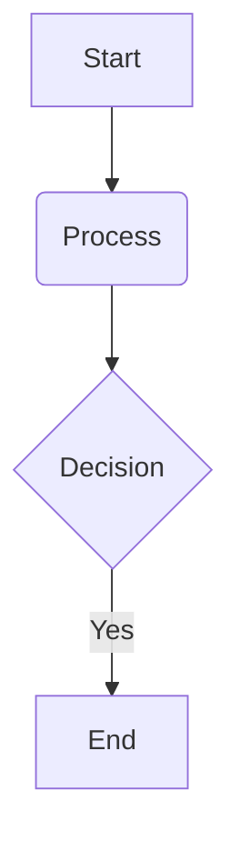

# Personal Wiki Reference

This document serves as a private reference guide for local development, directory configuration, and content editing.

## Commands

All commands are run from the project root:

- `bun dev` - Start the local development server (runs at `http://localhost:4321/`)
- `bun run build` - Compile the static production site (outputs to `./dist/`)
- `bun run preview` - Preview the compiled static site locally

---

## Viewing Content Changes

### 1. Locally (Instant Hot Reloading)
- Start the development server by running `bun dev`.
- Any changes you make to the markdown articles or metadata files inside the `content/` folder will **automatically update and hot-reload** in the browser at `http://localhost:4321/` without needing to restart the server.

### 2. In Production (GitHub Pages Deployment)
- Commit and push your changes to your remote repository's main branch:
  ```bash
  git add .
  git commit -m "update content"
  git push origin main
  ```
- A GitHub Actions workflow (`deploy.yml`) will automatically trigger, compile the static files, and deploy the new version to GitHub Pages within a few minutes.

---

## Directory Structure & Routing

Pages and sidebar navigation are generated dynamically from the structure of the `content/` folder:

```text
content/
├── config.yml            # Site-wide settings (branding & titles)
├── [page].md             # Root-level pages (e.g. aboutme.md, resume.md)
└── [directory]/          # Section directory
    ├── _meta.yml         # Section configuration
    └── [article].md      # Section article
```

### Site Configuration (`content/config.yml`)
Configures the global site header branding and title suffix:
```yaml
logoPrompt: "$_"
logoMain: "Wiki"
logoSecondary: "Knowledge Base"
titleSuffix: "Knowledge Base"
```

### Section Configuration (`_meta.yml`)
Every subfolder in the `content/` directory must contain a `_meta.yml` file to define how it is displayed in the sidebar:
```yaml
title: "Category Title"       # Label shown in the sidebar navigation
description: "Description"    # Description displayed on the category landing page
icon: "book"                  # Lucide icon ID (e.g. book, server, terminal, file)
order: 10                     # Relative sort priority in the sidebar (ascending)
```

### Adding Folders & Sub-Categories
To create a new navigation category or a nested sub-category:

1. **Create the Folder**: Add a new folder under `content/` (or nested inside an existing folder, e.g., `content/technical-notes/databases/`).
2. **Configure `_meta.yml`**: You **must** create a `_meta.yml` file in the new folder. This defines the category's sidebar title, Lucide icon, description, and relative sort order.
3. **Add Articles**: Place `.md` or `.mdx` files inside the folder. The URL path is built dynamically from the directory structure (e.g. `content/technical-notes/databases/postgres.md` becomes the URL route `/technical-notes/databases/postgres/`).

---

## Writing Articles

Articles are written in Markdown (`.md` or `.mdx`) and must begin with YAML frontmatter metadata:

```markdown
---
title: "Article Title"
description: "Brief summary of the article"
date: 2026-06-12
tags: ["tag-name"]
order: 10
draft: false
---
```

### Frontmatter Schema:
- `title`: The main heading of the page and label in the sidebar.
- `description`: Subheading/summary metadata.
- `date`: Rendered relatively in the UI (e.g., *today*, *this week*). Hovering instantly displays the absolute date in `dd mon yyyy` format.
- `tags`: List of keywords for search and categorization.
- `order`: Sort priority in the sidebar (folders and files are sorted together ascending).
- `draft`: If `true`, the page is excluded from static builds.

---

## Custom Markdown Elements

### Admonition Callouts
Use GitHub-style blockquote alerts to display highlighted info panels:

```markdown
> [!NOTE]
> Informational callout panel.

> [!TIP]
> Helpful recommendation or tip.

> [!IMPORTANT]
> Critical information to note.

> [!WARNING]
> Warning details.

> [!CAUTION]
> High-risk warning or caveat.
```

### Mermaid Diagrams
Use fenced code blocks tagged `mermaid` to draw flowcharts:

**Syntax Reference:**
````markdown

````

**Rendered Output:**


---

## Deployment

Pushes to the `main` or `master` branches automatically compile and deploy the site to GitHub Pages via GitHub Actions.
- **Workflow definition**: `.github/workflows/deploy.yml`
- **Manual trigger**: Run the **Deploy to GitHub Pages** workflow under the repository's **Actions** tab on GitHub.

---

## Custom Domain Configuration

This site is hosted under the custom domain configured in `public/CNAME`. 

### Astro Site URL Resolution
`astro.config.mjs` dynamically reads your domain name from `public/CNAME` at build time to configure sitemaps and canonical links automatically.

### How to Change Your Domain
If you want to update the custom domain:
1. Open [public/CNAME](file:///c:/Users/Indranil%20Paul/code/indranil-paul-git.github.io/public/CNAME) and replace the domain name with your new domain.
2. Go to your repository settings (**Settings** -> **Pages**) and enter your new custom domain in the **Custom domain** box, then click **Save**.
3. Commit and push your changes to GitHub.
3. Update your DNS settings with your domain registrar:
   - **For an Apex Domain (e.g., `example.com`):** Point `A` records to GitHub Pages IPs:
     ```text
     185.199.108.153
     185.199.109.153
     185.199.110.153
     185.199.111.153
     ```
   - **For a Subdomain (e.g., `test.example.com` or `www.example.com`):** Create a `CNAME` record pointing the subdomain to your GitHub default URL: `indranil-paul-git.github.io`.

---

## Custom 404 Page

Nonexistent paths automatically trigger a custom 404 page generated via [src/pages/404.astro](file:///c:/Users/Indranil%20Paul/code/indranil-paul-git.github.io/src/pages/404.astro), which compiles to `404.html` at the build root for GitHub Pages to serve automatically.
