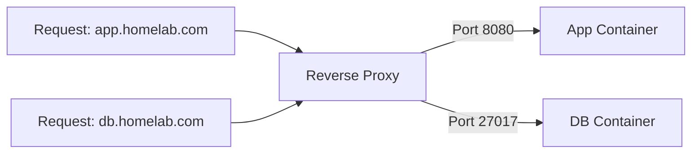
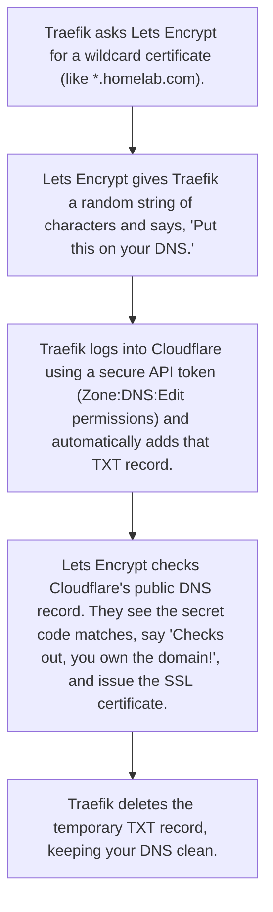

When you start self-hosting a few services in a homelab, everything seems straightforward. You run a media server, a dashboard, and maybe a database. But as your lab grows, you quickly run into some annoying pain points.

### The Pain Points of a Proxy-less Homelab

* **The Port Memory Tax**: Every service you spin up gets its own port. Suddenly, your bookmarks are full of IP address and port combinations like `192.168.1.100:8096` or `192.168.1.100:3000`. If you forget the port number, you're locked out of your own service until you check your configs.
* **Port Conflicts**: What happens when two different services both want to run on port `8080`? You're forced to map one to a random port like `8081` or `9090`, making them even harder to memorize.
* **The SSL Certificate Mess**: Running HTTPS on multiple containers means configuring certificates for each one individually. If you don't, your browser will constantly yell at you with red "Not Secure" warning screens.
* **Broad Exposure**: Running services directly on host ports exposes them to your entire local network on the host IP, which isn't always ideal for security.

---

## The Solution: A Reverse Proxy

A **reverse proxy** solves all of these problems by acting as a single, smart entry point at the edge of your network. Instead of hitting your containers directly, all incoming traffic goes through the proxy first.



Here is how it fixes our homelab pain points:
* **No More Ports (Subdomain Routing)**: The reverse proxy listens on standard web ports—HTTP (80) and HTTPS (443). It inspects the incoming hostname (like `app.homelab.com`) and forwards the traffic to the correct container. You only need to memorize names, not port numbers.
* **No More Port Conflicts**: Your containers can run on whatever internal ports they want. Since they communicate inside a private virtual network, you can run ten different databases on internal port `5432` without any collisions. The proxy routes traffic to each one based on their subdomain.
* **Centralized SSL Termination**: The proxy handles SSL/TLS certificates in one place. Connections from your devices to the proxy are fully encrypted and secure, while the proxy talks to your backend containers over the private network. Your containers don't need to know anything about certificates, saving you setup time.

---

## Why Traefik?

Traditional reverse proxies like Nginx or HAProxy require you to write and maintain separate configuration files for each route, and restart or reload the proxy service whenever you add or modify a service. Other options, like Nginx Proxy Manager, solve this by using a dedicated web interface, but still require you to log into a separate console to configure routes manually.

**Traefik** is designed around container autodiscovery. Instead of using a separate management console or configuration files to define routes, Traefik integrates directly with the Docker daemon. 

By reading the metadata labels attached to your containers inside `docker-compose.yml`, Traefik automatically detects when services start or stop and configures the routes in real-time. Your routing configuration lives directly inside your service definition, keeping your infrastructure self-contained.

---

## Domain Routing on a Local Network

To route subdomains to services on a local network, you can point a public domain name to a private LAN IP address. This requires a few preparation steps:

1. **Static IP Assignment**: Assign a static IP address to your homelab server. Log into your local router's management console and configure a **DHCP reservation** (or static lease) that binds your server's MAC address to a fixed LAN IP (e.g., `192.168.1.100`). This ensures the server always retains the same address.
2. **Get a Domain**: Register a domain name (e.g., `homelab.com`).
   > [!NOTE]
   > If you purchased your domain from a registrar other than Cloudflare, log into that registrar's dashboard and delegate DNS management by changing the default nameservers to point to your assigned Cloudflare nameservers.
3. **Cloudflare DNS Configuration**: In the Cloudflare DNS dashboard, configure the following two records to map your domains:
   * **Root Domain A Record**:
     * **Type**: `A`
     * **Name**: `@` (represents the root domain `homelab.com`)
     * **IPv4 Address**: `192.168.1.100` (your reserved server LAN IP)
     * **Proxy Status**: *DNS Only* (grey cloud, as Cloudflare cannot proxy requests to a private IP)
   * **Wildcard Subdomain CNAME Record**:
     * **Type**: `CNAME`
     * **Name**: `*` (covers all subdomains, e.g., `app.homelab.com`)
     * **Target**: `homelab.com`
     * **Proxy Status**: *DNS Only* (grey cloud)

When a local device requests `service.homelab.com`, the DNS lookup resolves the name to the wildcard CNAME target `homelab.com`, which points to the root `A` record resolving to your server's local LAN IP `192.168.1.100`. The traffic is then routed straight to your server locally.

---

## SSL Certificates via DNS-01 Challenge

If you want that satisfying green padlock in your browser (and to stop your browser from complaining about "unsafe" connections), your reverse proxy needs a real SSL certificate.

Normally, certificate authorities like Let's Encrypt verify that you own a domain by knocking on your door. Specifically, they try to reach your server on port 80 (HTTP) to see if you can serve a special file. This is called the HTTP-01 challenge. But in a homelab, opening port 80 on your home router to the entire internet just to get a certificate is a pretty bad idea.

This is where the **DNS-01 challenge** steps in, and it's basically a game of DNS telephone. 

Instead of knocking on your home server's door, Let's Encrypt says: 
*“Hey, if you actually own `homelab.com`, prove it. Go create a temporary TXT record with this random secret code on your DNS provider.”*

Here is how the sequence plays out dynamically:



The best part? Because we are using Cloudflare, this entire check happens on Cloudflare's public servers, not your home network. You get a fully valid, auto-renewing wildcard SSL certificate for your internal services, and your home network stays completely closed off from the outside world. No open ports, no public exposure, just clean HTTPS.

### How to Get Your Cloudflare API Token

To let Traefik handle the DNS telephone game automatically, you need to give it a key to your Cloudflare front door—but you shouldn't use your main account password or global API key. Instead, create a scoped **API Token** that can *only* edit DNS records:

1. Log into your **Cloudflare Dashboard**.
2. Go to your user profile in the top-right and select **My Profile** > **API Tokens**.
3. Click **Create Token**.
4. Choose the **Edit zone DNS** template.
5. Under **Permissions**, ensure it says `Zone` - `DNS` - `Edit`.
6. Under **Zone Resources**, select `Include` - `Specific zone` - `yourdomain.com` (or `All zones` if you want it to manage multiple domains).
7. Click **Continue to summary**, then **Create Token**.
8. Copy the token immediately and save it somewhere safe. Cloudflare only shows it to you once!

Once you have this token, you pass it to Traefik as an environment variable (`CF_DNS_API_TOKEN`), and it will handle the rest.

This process secures your local subdomains with wildcard SSL certificates (`*.homelab.com`) while keeping your home network completely isolated from external inbound traffic.

---

## Traefik Implementation

Here is the full Docker Compose configuration for mapping Traefik as the reverse proxy:

> [!IMPORTANT]
> Do **not** hardcode your actual Cloudflare API token directly inside the `docker-compose.yml` file. Instead, create a `.env` file in the same directory containing `CF_DNS_API_TOKEN=your_actual_token_here` and reference it via the `${CF_DNS_API_TOKEN}` variable as shown in the environment block. This keeps your secrets secure from being accidentally committed to version control.

```yaml
services:
  traefik:
        image: traefik
        container_name: traefik
        environment:
            CF_DNS_API_TOKEN: ${CF_DNS_API_TOKEN}
        volumes:
            - /var/run/docker.sock:/var/run/docker.sock:ro
            - /srv/docker/traefik/acme.json:/acme.json
        networks:
            - reverse-proxy
        ports:
            - 80:80
            - 443:443
        expose:
            - 8080
        restart: unless-stopped
        command: # Static Configuration
            --api=true
            --api.insecure=true
            --api.disabledashboardad=true
            --entryPoints.web.address=:80
            --entryPoints.web.http.redirections.entryPoint.to=websecure
            --entryPoints.websecure.address=:443
            --entryPoints.websecure.http.tls.certResolver=letsencrypt
            --entryPoints.websecure.http.tls.domains[0].main=homelab.com
            --entryPoints.websecure.http.tls.domains[0].sans=*.homelab.com,*.arr.homelab.com
            --providers.docker=true
            --providers.docker.exposedByDefault=false
            --certificatesresolvers.letsencrypt.acme.email=admin@homelab.com
            --certificatesresolvers.letsencrypt.acme.dnschallenge.provider=cloudflare
            --certificatesresolvers.letsencrypt.acme.dnschallenge.resolvers=1.1.1.1:53,8.8.8.8:53
        labels: # Dynamic Configuration
            traefik.enable: true
            traefik.http.routers.traefik.rule: Host(`traefik.homelab.com`)
            traefik.http.routers.traefik.service: api@internal
            traefik.http.routers.traefik.entrypoints: websecure

networks:
  reverse-proxy:
    external: true
```

### Explaining the Configuration Flags

Let's break down the key flags passed to Traefik in the `command` block:

* **EntryPoints (`web` & `websecure`)**:
  * `--entryPoints.web.address=:80` defines the HTTP entrypoint.
  * `--entryPoints.web.http.redirections.entryPoint.to=websecure` redirects all HTTP traffic automatically to HTTPS (port 443) so you never visit an insecure site.
  * `--entryPoints.websecure.address=:443` is the entrypoint for secure HTTPS traffic.
* **Let's Encrypt Wildcard Certificates**:
  * `--entryPoints.websecure.http.tls.certResolver=letsencrypt` tells Traefik to secure this entrypoint using certificates from Let's Encrypt.
  * `--entryPoints.websecure.http.tls.domains[0].main=homelab.com` sets the main domain.
  * `--entryPoints.websecure.http.tls.domains[0].sans=*.homelab.com,*.arr.homelab.com` adds wildcard coverage for subdomains (like `app.homelab.com`) and any *nested* subdomains (like `radar.arr.homelab.com`).
* **Docker Provider**:
  * `--providers.docker=true` enables container autodiscovery.
  * `--providers.docker.exposedByDefault=false` is a crucial security step—it tells Traefik *not* to expose a container unless you explicitly set the label `traefik.enable=true` on it.
* **DNS-01 Challenge Configuration**:
  * `--certificatesresolvers.letsencrypt.acme.dnschallenge.provider=cloudflare` sets Cloudflare as the provider for our DNS verification.
  * `--certificatesresolvers.letsencrypt.acme.dnschallenge.resolvers=1.1.1.1:53,8.8.8.8:53` tells Let's Encrypt to query Cloudflare and Google DNS servers directly to verify the TXT record matches immediately instead of waiting for local DNS cache propagation.

---

## Service Routing

With Traefik, routing is dynamic. Instead of updating a configuration file and reloading the proxy every time you spin up a new container, you tell Traefik how to route traffic using **Docker Labels**.

### Why the Docker Socket is Required

For this automatic discovery to work, Traefik needs a way to watch the Docker daemon and see what containers are starting or stopping. This is why the volume mount `/var/run/docker.sock:/var/run/docker.sock:ro` is critical.

The **Docker Socket** is the API socket that the Docker daemon listens to. By mounting it inside the Traefik container (specifically as read-only, `:ro`, for security), you are giving Traefik a direct window to inspect container events in real-time. Whenever you run `docker compose up`, Traefik instantly notices the event, reads the container's labels, and builds the routing rule. Without this socket mount, Traefik is blind and auto-discovery won't work.

### How Labels Work

Docker labels are metadata key-value pairs attached to your containers. When Traefik reads these labels, it translates them into three core routing concepts:

1. **Enable** (`traefik.enable=true`): Tells Traefik to explicitly expose this container (since we set `exposedByDefault=false` globally).
2. **Router** (`traefik.http.routers.<name>.rule`): Defines the rule that triggers the route—usually matching a specific subdomain (like `Host('app.homelab.com')`) and specifying the entrypoint (like `entrypoints=websecure` for port 443).
3. **Service** (`traefik.http.services.<name>.loadbalancer.server.port`): Tells Traefik which internal port inside the container the application is listening on (e.g. port `3000` or `8096`).

### Shared Network Requirement

For Traefik to route traffic to your containers, they must share a Docker network. In these examples, we use an external network named `reverse-proxy`.

Before launching your compose stacks, you must create this network once in your terminal:

```bash
docker network create reverse-proxy
```

By connecting both Traefik and your applications to this shared `reverse-proxy` network, Traefik can communicate with your container IPs directly over the private internal network. If a container is not on the same network as Traefik, Traefik will not be able to forward requests to it, resulting in a gateway timeout error (504).

Here are a couple of examples showing this in action:

### Example 1: Web Dashboard
To route traffic for a local dashboard serving internally on port `3000`:

```yaml
services:
  dashboard:
    image: gethomepage/homepage:latest
    container_name: homelab-dashboard
    networks:
      - reverse-proxy
    expose:
      - 3000
    labels:
      - traefik.enable=true
      - traefik.http.routers.dashboard.rule=Host(`home.homelab.com`)
      - traefik.http.routers.dashboard.entrypoints=websecure
      - traefik.http.services.dashboard.loadbalancer.server.port=3000
```

### Example 2: Media Server
To route traffic for a media server serving internally on port `8096`:

```yaml
services:
  media-server:
    image: jellyfin/jellyfin:latest
    container_name: media-server-container
    networks:
      - reverse-proxy
    expose:
      - 8096
    labels:
      - traefik.enable=true
      - traefik.http.routers.media.rule=Host(`watch.homelab.com`)
      - traefik.http.routers.media.entrypoints=websecure
      - traefik.http.services.media.loadbalancer.server.port=8096
```

In both examples, Traefik automatically detects the labels upon container startup, registers the hostnames (`home.homelab.com` and `watch.homelab.com`), secures them with the wildcard SSL certificate, and routes the traffic to the correct internal container port.
