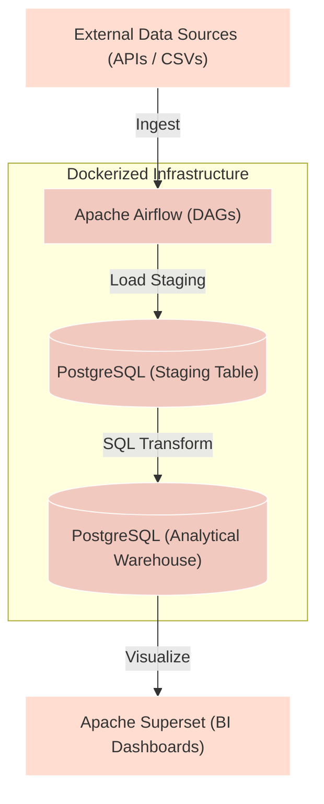

This project establishes a containerized, self-hosted data engineering stack. The architecture orchestrates data ingestion, processes transformations locally, and exposes dashboards for business intelligence.

---

## 1. System Architecture

Below is the visual flow of data from ingestion to dashboarding:

---

## 2. Technical Stack Components

*   **Docker & Docker Compose**: Orchestrates all services on a shared internal network with isolated volumes for PostgreSQL data persistence and Airflow logs.
*   **Apache Airflow**: Runs scheduler, webserver, and local worker services to orchestrate Python-defined Directed Acyclic Graphs (DAGs).
*   **PostgreSQL**: Serves two purposes:
    1.  Airflow metadata backend database.
    2.  Analytics database structured into two schemas: `staging` (raw append-only tables) and `analytics` (cleaned dimension and fact tables).
*   **Apache Superset**: Connects natively to the Postgres analytics database via SQLAlchemy to build clean dashboards.

---

## 3. Implementation Blueprint

### Phase 1: Environment Setup
Define a multi-container `docker-compose.yml` stack consisting of:
- Airflow containers (Webserver, Scheduler, Triggerer, Postgres backend).
- A standalone data warehouse Postgres container.
- Apache Superset container.

Configure shared environment variables, file mount mappings for DAG files, and database user permissions.

### Phase 2: Ingestion & DAG Design
Build an Airflow DAG to automate:
- Fetching JSON payloads from a public REST API or mock CSV generator.
- Parsing and validation of schema fields.
- Writing to the `staging` PostgreSQL schema using `insert ... on conflict` statements to handle upserts.

### Phase 3: Analytical SQL Transformations
Develop SQL transformation scripts to process raw staging records into analytical tables:
- Standardize datatypes and timestamps.
- Apply business logic transformations.
- Create optimized views or table structures for reporting metrics.

### Phase 4: Business Intelligence Dashboards
Spin up Apache Superset, register the Postgres warehouse as a dataset, and configure:
- Custom SQL queries to build reporting slices.
- Visual charts: line graphs for trends, bar graphs for categorical aggregates, and key performance indicator (KPI) metric cards.
