This project outlines a cloud-native Data Lakehouse platform built on Databricks. The architecture combines the reliability and ACID transaction support of data warehouses with the flexibility and cost-effectiveness of raw cloud storage.

---

## 1. Medallion Architecture

Below is the standard Medallion architecture showing the three processing stages:

```mermaid
graph LR
    source["Cloud Landing Zone (S3 / ADLS)"] -->|Auto Loader| bronze["Bronze Layer (Raw Delta)"]
    bronze -->|Enrich & Deduplicate| silver["Silver Layer (Clean Delta)"]
    silver -->|Aggregate & Optimize| gold["Gold Layer (Analytical Delta)"]
    gold -->|SQL Warehouse| bi["BI Tools & Analytics"]

    classDef stage fill:#cc295f,stroke:#ffffff,fill-opacity:0.25,stroke-opacity:0.9;
    classDef output fill:#ff7e47,stroke:#ffffff,fill-opacity:0.25,stroke-opacity:0.9;
    class bronze,silver,gold stage;
    class source,bi output;
```

---

## 2. Platform Capabilities

*   **ACID Transactions**: Implemented via Delta Lake storage format, enabling concurrent reads/writes and historical versioning (Time Travel).
*   **Databricks Auto Loader**: Automates ingestion of high-frequency streaming files from cloud storage with schema evolution tracking.
*   **PySpark & Structured Streaming**: Powers transformations and data enrichment workflows at scale.
*   **Databricks SQL & Unity Catalog**: Provides centralized governance, row/column-level access control, and a dedicated SQL execution warehouse.

---

## 3. Implementation Blueprint

### Phase 1: Workspace & Cloud Storage Setup
Provision cloud infrastructure and configure:
- Storage buckets (AWS S3 or Azure ADLS Gen2) to serve as the storage backend.
- Identity and Access Management (IAM) roles for secure Databricks workspace mounts.
- Unity Catalog metastore configuration for centralized governance.

### Phase 2: Raw Ingestion (Bronze Layer)
Implement Databricks Notebooks to ingest incoming source files:
- Use PySpark Auto Loader (`cloudFiles`) to capture raw JSON/CSV dumps dynamically.
- Store the ingested stream as append-only Delta tables in the `bronze` schema without modifying structure.

### Phase 3: Data Quality & Enrichment (Silver Layer)
Transform the bronze raw data to silver tables:
- Parse nested JSON elements and enforce strict schemas.
- Clean invalid inputs, filter nulls, and deduplicate primary keys.
- Perform joins against lookup dimensions (e.g., product or location tables).

### Phase 4: Business Aggregations (Gold Layer)
Compute key metrics for business consumption:
- Build summary aggregates (e.g., daily sales, active user counts).
- Apply data organization optimizations such as `Z-ORDER BY` on query dimensions to improve query speeds.
- Save the results as read-optimized Gold Delta tables.

### Phase 5: SQL Warehouse Serving
Set up a Databricks SQL Serverless Warehouse:
- Connect the Gold Delta tables to Databricks SQL Dashboards or external BI tools.
- Write analytical queries to evaluate key business indicators.
