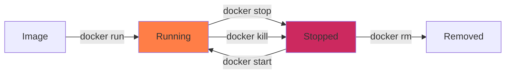
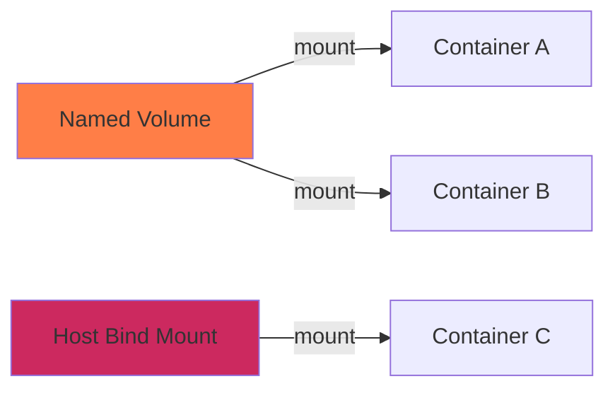
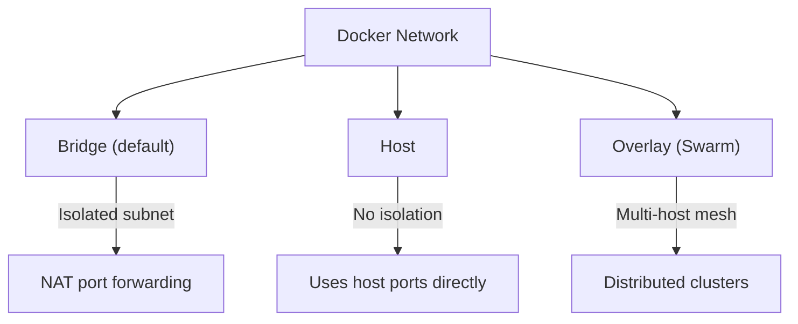

Quick-reference commands for Docker container workflows, networking, and orchestration.

---

## 1. Container Lifecycle

Docker containers are isolated processes running from images. An image is a read-only template; a container is a running (or stopped) instance of that image. The lifecycle flows from `create` → `start` → `stop` → `remove`, though `docker run` combines the first two steps.



Pull an image from Docker Hub or a private registry to local storage.
```bash
docker pull <image>:<tag>
```

Run a container in detached mode with a custom name, mapping host port to container port.
```bash
docker run -d --name <name> -p 8080:80 <image>
```

Run a temporary container that is automatically removed on exit, useful for one-off tasks.
```bash
docker run --rm -it <image> /bin/sh
```

List all running containers with their IDs, status, and port mappings.
```bash
docker ps
```

List all containers including stopped ones.
```bash
docker ps -a
```

Stop a running container gracefully by sending SIGTERM, then SIGKILL after timeout.
```bash
docker stop <container>
```

Force-kill a running container immediately without waiting for graceful shutdown.
```bash
docker kill <container>
```

Start a previously stopped container.
```bash
docker start <container>
```

Restart a container by stopping and starting it in sequence.
```bash
docker restart <container>
```

Remove a stopped container permanently.
```bash
docker rm <container>
```

Force-remove a running container without stopping it first.
```bash
docker rm -f <container>
```

---

## 2. Inspecting & Debugging

View the real-time log output of a container, following new entries as they appear.
```bash
docker logs -f <container>
```

View the last N lines of container logs.
```bash
docker logs --tail 100 <container>
```

Open an interactive shell session inside a running container for debugging.
```bash
docker exec -it <container> /bin/sh
```

Run a one-off command inside a running container without opening an interactive shell.
```bash
docker exec <container> cat /etc/hosts
```

View detailed metadata about a container including its IP address, mounts, and environment.
```bash
docker inspect <container>
```

Display a live stream of container resource usage (CPU, memory, network I/O).
```bash
docker stats
```

Show the running processes inside a container.
```bash
docker top <container>
```

---

## 3. Images & Registry

List all locally cached images with their tags and sizes.
```bash
docker images
```

Build an image from a Dockerfile in the current directory and tag it with a name.
```bash
docker build -t <name>:<tag> .
```

Tag an existing local image with a new name for pushing to a registry.
```bash
docker tag <image>:<tag> <registry>/<image>:<tag>
```

Push a tagged image to a remote registry (Docker Hub, GHCR, or private).
```bash
docker push <registry>/<image>:<tag>
```

Remove a local image. Use `-f` to force removal if containers depend on it.
```bash
docker rmi <image>
```

Remove all unused images, stopped containers, and dangling build cache in one pass.
```bash
docker system prune -a
```

View the layer history and build instructions of an image.
```bash
docker history <image>
```

---

## 4. Volumes & Data

Docker containers are ephemeral — when a container is removed, its filesystem is destroyed. Volumes are the mechanism for persisting data beyond the container lifecycle. They live on the host and are mounted into containers at runtime.



Create a named volume managed by Docker for persistent storage.
```bash
docker volume create <volume-name>
```

Run a container with a named volume mounted at a specific path inside the container.
```bash
docker run -d -v <volume-name>:/data <image>
```

Bind-mount a host directory directly into the container filesystem (useful for development).
```bash
docker run -d -v /host/path:/container/path <image>
```

List all volumes currently managed by Docker.
```bash
docker volume ls
```

Inspect the mount point and metadata of a specific volume.
```bash
docker volume inspect <volume-name>
```

Remove a named volume permanently (data is lost).
```bash
docker volume rm <volume-name>
```

Remove all volumes not currently attached to any container.
```bash
docker volume prune
```

---

## 5. Networking

Docker containers communicate via virtual networks created on the host. By default, every container joins the `bridge` network, which provides NAT-based isolation. Containers on the same user-defined bridge can resolve each other by container name as DNS hostnames.



Create a user-defined bridge network for container-to-container DNS resolution.
```bash
docker network create <network-name>
```

Run a container attached to a specific network.
```bash
docker run -d --network <network-name> --name <container> <image>
```

Connect an already running container to an additional network.
```bash
docker network connect <network-name> <container>
```

Disconnect a container from a network without stopping it.
```bash
docker network disconnect <network-name> <container>
```

List all Docker networks on the host.
```bash
docker network ls
```

Inspect a network to see its subnet configuration, gateway, and connected containers.
```bash
docker network inspect <network-name>
```

Remove a user-defined network (all containers must be disconnected first).
```bash
docker network rm <network-name>
```

Create a network with a specific subnet range and gateway for static IP assignment.
```bash
docker network create \
  --driver=bridge \
  --subnet=172.28.0.0/16 \
  --ip-range=172.28.5.0/24 \
  --gateway=172.28.0.1 \
  secure-bridge-net
```

> [!NOTE]
> Containers on different bridge networks cannot communicate by default. They must share at least one common network. This is by design for isolation.

---

## 6. Docker Compose

Compose defines multi-container applications in a single `docker-compose.yml` file. It manages the full lifecycle of interconnected services — building images, creating networks, mounting volumes, and orchestrating startup order — with a single command.

Start all services defined in the compose file in detached mode, building images if needed.
```bash
docker compose up -d --build
```

Stop and remove all containers, networks, and anonymous volumes created by compose.
```bash
docker compose down
```

Stop and remove everything including named volumes (destructive — wipes persistent data).
```bash
docker compose down -v
```

View the combined log output of all running compose services.
```bash
docker compose logs -f
```

View logs for a specific service only.
```bash
docker compose logs -f <service-name>
```

List the status of all services in the current compose project.
```bash
docker compose ps
```

Restart a single service without affecting the others.
```bash
docker compose restart <service-name>
```

Pull the latest images for all services defined in the compose file.
```bash
docker compose pull
```

Rebuild and recreate only the containers whose images or configs have changed.
```bash
docker compose up -d --build --force-recreate
```

Open a shell inside a running compose service container.
```bash
docker compose exec <service-name> /bin/sh
```

---

## 7. Cleanup & Maintenance

Show total disk usage broken down by images, containers, volumes, and build cache.
```bash
docker system df
```

Remove all stopped containers, unused networks, dangling images, and build cache.
```bash
docker system prune
```

Aggressive cleanup including unused images (not just dangling) and volumes.
```bash
docker system prune -a --volumes
```

Remove all stopped containers.
```bash
docker container prune
```

Remove all dangling (untagged) images left over from builds.
```bash
docker image prune
```

---

## 8. Installation

### Mac (Colima)

Colima runs a lightweight Linux VM with Docker runtime on macOS, replacing Docker Desktop. It uses Lima under the hood and supports both Intel and Apple Silicon.

Install Colima and the Docker CLI via Homebrew.
```bash
brew install colima docker docker-compose
```

Start the Colima VM with 4 CPUs, 8 GB RAM, and 60 GB disk. Adjust resources to your machine.
```bash
colima start --cpu 4 --memory 8 --disk 60
```

Verify the Docker daemon is reachable through Colima's socket.
```bash
docker context use colima && docker info
```

Stop the Colima VM when not in use to free system resources.
```bash
colima stop
```

> [!NOTE]
> Colima sets itself as the active Docker context on start. If you switch between Colima and Docker Desktop, use `docker context use` to switch back.

---

### Windows (Docker Desktop)

Docker Desktop for Windows runs containers through a lightweight WSL 2 backend. It integrates directly with Windows Terminal, VS Code, and PowerShell.

Download and install Docker Desktop from the official site, then enable WSL 2 integration in Settings → General. After installation, verify from PowerShell:

```powershell
docker version
```

Ensure WSL 2 is enabled as the backend (Settings → General → Use the WSL 2 based engine). This is significantly faster than the legacy Hyper-V backend.

```powershell
wsl --set-default-version 2
```

---

### Linux (Ubuntu / Debian)

Install Docker Engine directly from Docker's official APT repository. This provides the daemon, CLI, and containerd runtime without Docker Desktop.

Uninstall any conflicting legacy packages first.
```bash
sudo apt remove docker docker-engine docker.io containerd runc
```

Install prerequisites and add Docker's official GPG key and repository.
```bash
sudo apt update && sudo apt install -y ca-certificates curl gnupg
sudo install -m 0755 -d /etc/apt/keyrings
curl -fsSL https://download.docker.com/linux/ubuntu/gpg | sudo gpg --dearmor -o /etc/apt/keyrings/docker.gpg
echo "deb [arch=$(dpkg --print-architecture) signed-by=/etc/apt/keyrings/docker.gpg] https://download.docker.com/linux/ubuntu $(. /etc/os-release && echo $VERSION_CODENAME) stable" | sudo tee /etc/apt/sources.list.d/docker.list
```

Install Docker Engine, CLI, and the compose plugin.
```bash
sudo apt update && sudo apt install -y docker-ce docker-ce-cli containerd.io docker-compose-plugin
```

Add your user to the `docker` group so you can run commands without `sudo`.
```bash
sudo usermod -aG docker $USER
```

Log out and back in for the group change to take effect, then verify.
```bash
docker run hello-world
```

---

### WSL 2 (Ubuntu - Standalone)

Run the following commands from a Windows PowerShell terminal to enable WSL 2 and install the default Ubuntu distribution.

Install WSL 2 and the official Ubuntu distribution on Windows.
```powershell
wsl --install -d Ubuntu
```

Once installation is complete, boot into the Ubuntu WSL environment to begin standalone setup.
```powershell
wsl -d Ubuntu
```

Inside the WSL Ubuntu distribution terminal, run the following commands to install Docker Engine directly (without installing Docker Desktop on Windows).

Uninstall any conflicting default Docker packages first.
```bash
sudo apt-get remove docker docker-engine docker.io containerd runc
```

Install packages to allow apt to use a repository over HTTPS, and add Docker's official GPG key.
```bash
sudo apt-get update && sudo apt-get install -y ca-certificates curl gnupg
sudo install -m 0755 -d /etc/apt/keyrings
curl -fsSL https://download.docker.com/linux/ubuntu/gpg | sudo gpg --dearmor -o /etc/apt/keyrings/docker.gpg
```

Register Docker's stable repository to your apt sources list.
```bash
echo "deb [arch=$(dpkg --print-architecture) signed-by=/etc/apt/keyrings/docker.gpg] https://download.docker.com/linux/ubuntu $(. /etc/os-release && echo $VERSION_CODENAME) stable" | sudo tee /etc/apt/sources.list.d/docker.list > /dev/null
```

Install Docker Engine, containerd, and the Docker Compose plugin.
```bash
sudo apt-get update && sudo apt-get install -y docker-ce docker-ce-cli containerd.io docker-buildx-plugin docker-compose-plugin
```

Enable systemd boot support inside WSL so services can be managed via systemctl.
```bash
sudo tee /etc/wsl.conf <<EOF
[boot]
systemd=true
EOF
```

Add your default user to the docker group to enable executing commands without sudo.
```bash
sudo usermod -aG docker $USER
```

Start the Docker service and configure it to boot automatically on WSL launch (run this after restarting WSL).
```bash
sudo systemctl enable --now docker
```

Verify that the standalone Docker daemon is active and functioning correctly.
```bash
docker run hello-world
```

> [!TIP]
> After configuring systemd, restart WSL 2 for changes to take effect by running `wsl --shutdown` in a Windows PowerShell window, and then boot back in using `wsl -d Ubuntu`.

