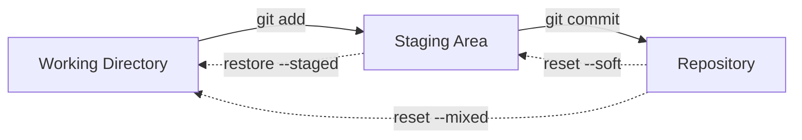
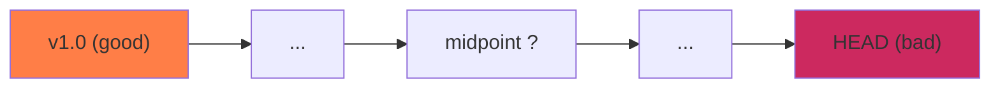
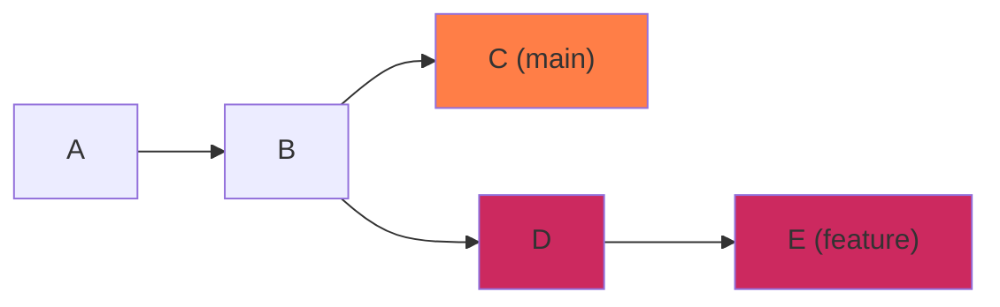

Quick-reference commands for advanced Git workflows.

---

## 1. Setup & Remotes

Create an empty Git repository or reinitialize an existing one in the current directory.
```bash
git init
```

Clone a remote repository from a URL (such as GitHub) to your local machine.
```bash
git clone <url>
```

List all configured remote repositories and their fetch/push URLs in a verbose list.
```bash
git remote -v
```

Link a local repository to a remote repository URL under a specific name (e.g. `origin`).
```bash
git remote add origin <url>
```

---

## 2. Branching

Show a list of all local branches in the current repository with your active branch highlighted.
```bash
git branch
```

Create a new branch pointing to the current commit without switching to it.
```bash
git branch <branch-name>
```

Change your active workspace branch to an existing local branch.
```bash
git checkout <branch-name>
```

Create a new branch and immediately switch your active workspace to it.
```bash
git checkout -b <branch-name>
```

Integrate the commit history of another branch (e.g. `feature-branch`) into your active branch.
```bash
git merge <branch-name>
```

---

## 3. Daily Workflow

Add modifications in a file to the staging area, preparing it to be committed.
```bash
git add <file>
```

Save staged changes as a new commit in the repository history with a descriptive message.
```bash
git commit -m "commit message"
```

Fetch changes from the remote tracking branch and merge them directly into your current branch.
```bash
git pull
```

Upload your local commits to the remote repository, setting the upstream branch tracker.
```bash
git push -u origin <branch-name>
```

The stash is a LIFO stack that saves your uncommitted changes (both staged and unstaged) so you can switch context without committing half-finished work. Each `push` adds an entry, `pop` removes and applies the latest one.

Save staged and unstaged local changes onto the stash stack with a custom description.
```bash
git stash push -m "description"
```

Save all local changes to the stash stack, including new files that have not yet been tracked by Git.
```bash
git stash -u
```

List all saved changes currently stored on the stash stack with their index numbers.
```bash
git stash list
```

Apply the changes from the latest stash and immediately delete it from the stash stack.
```bash
git stash pop
```

Apply the changes from a specific stash index (e.g., stash number 2) while keeping it on the stack.
```bash
git stash apply stash@{2}
```

Delete a specific stashed change from the stack using its stash index number.
```bash
git stash drop stash@{0}
```

Permanently delete all saved changes currently stored on the stash stack.
```bash
git stash clear
```

---

## 4. Inspecting & Undoing Changes

Git tracks changes across three areas: the **working directory** (your actual files on disk), the **staging area** (also called the index, where `git add` prepares changes), and the **repository** (committed snapshots referenced by HEAD). Every inspect and undo command operates on the boundaries between these areas.



`git diff` compares adjacent areas. `git restore` discards changes in the working directory or unstages from the index. `git reset` moves HEAD backward through commits — the mode (`--soft`, `--mixed`, `--hard`) controls how far back changes cascade through the three areas.

Show differences between the modifications in your working directory and the index.
```bash
git diff
```

Show differences between your staged changes (the index) and the last commit.
```bash
git diff --staged
```

Discard unstaged changes in your working directory to restore a file to the last committed state.
```bash
git restore <file>
```

Discard all unstaged edits in the current directory and all subdirectories recursively.
```bash
git restore .
```

Remove a file from the staging area (index) while keeping all edits in your working directory.
```bash
git restore --staged <file>
```

Remove all staged edits in the current directory from the index while keeping your working tree files intact.
```bash
git restore --staged .
```

Remove the last local commit, keeping all modified files staged in the index ready for re-committing.
```bash
git reset --soft HEAD~1
```

Remove the last commit and unstage all changes, keeping the edits in your working directory.
```bash
git reset --mixed HEAD~1
```

Delete the last commit and completely wipe out all associated edits from your working directory.
```bash
git reset --hard HEAD~1
```

Fetch the latest state from remote and overwrite the local branch to match it exactly, discarding local edits.
```bash
git fetch origin && git reset --hard origin/main
```

---

## 5. History & Search

View a graphical terminal tree representation of all commits, branch forks, and merge histories.
```bash
git log --oneline --graph --all --decorate
```

View who made changes to each line of a file, along with the corresponding commit hashes and dates.
```bash
git blame <file>
```

View commit and author metadata restricted to a specific line range inside a file.
```bash
git blame -L 10,20 <file>
```

Search commit history for the introduction or removal of a specific text string within diffs.
```bash
git log -S "search_string"
```

Search commit history for modifications that match a specific regular expression pattern in the diffs.
```bash
git log -G "regex"
```

List all commits in the current branch's history that were authored by a specific developer.
```bash
git log --author="Author Name"
```

View the commit log filtered to show only commits created within a specific time range.
```bash
git log --since="2 weeks ago" --until="yesterday"
```

View the complete commit history for a file, following it back through past renames and relocations.
```bash
git log --follow <file>
```

Bisect performs a binary search across your commit history to isolate the exact commit that introduced a bug. You mark one commit as `bad` (has the bug) and another as `good` (bug-free), and Git checks out the midpoint for you to test. Each iteration halves the remaining suspects, finding the culprit in O(log n) steps.



Initiate a git bisect session to find the specific commit that introduced a bug in history.
```bash
git bisect start
```

Instruct the bisect session that the current active commit compiles with the bug present.
```bash
git bisect bad
```

Instruct the bisect session that a specific past commit compiled successfully without the bug.
```bash
git bisect good <commit-hash>
```

Terminate the bisect session and return the workspace back to your original active branch.
```bash
git bisect reset
```

---

## 6. Advanced Rewriting

Rebase replays your branch's commits on top of another branch's tip, rewriting history into a clean linear sequence. Unlike merge (which creates a merge commit preserving both branch lines), rebase produces a straight-line history as if you branched off the latest commit. The tradeoff: rebased commits get new hashes, so never rebase commits that have already been pushed to a shared remote.



After running `git rebase main` from the feature branch, commits D and E are replayed on top of C as new commits with different hashes:


Start an interactive rebase to squash, edit, reorder, or delete commits in the last N commits of history.
```bash
git rebase -i HEAD~5
```

Resume the rebase process after manually fixing merge conflicts and staging the resolved files.
```bash
git add <file> && git rebase --continue
```

Cancel the rebase operation entirely and return the branch back to its pre-rebase state.
```bash
git rebase --abort
```

Cherry-pick copies a single commit from any branch and applies it as a new commit on your current branch. It's useful for hotfixes — apply a specific bugfix from `develop` onto `main` without merging the entire branch. The original commit stays untouched; you get a new commit with the same diff but a different hash.

Apply the changes from a single commit on another branch directly onto your current branch.
```bash
git cherry-pick <commit-hash>
```

Resume the cherry-pick process after manually resolving merge conflicts and staging the files.
```bash
git add <file> && git cherry-pick --continue
```

Cancel the active cherry-pick operation and revert the working directory to the pre-cherry-pick state.
```bash
git cherry-pick --abort
```

---

## 7. Tags & Releases

Create a tagged release point with a custom message to mark a specific commit in history.
```bash
git tag -a v1.0.0 -m "release v1.0.0"
```

Upload release tags to the remote repository to make them visible to other collaborators.
```bash
git push origin --tags
```

---

## 8. Disaster Recovery

The reflog is Git's local safety journal. It records every movement of HEAD — commits, checkouts, rebases, resets, and even operations on deleted branches. If you accidentally `reset --hard` or delete a branch, the commit hash is still sitting in the reflog for 90 days by default. It's your local undo history when everything else looks lost.


Show the history of all local HEAD movements, including commits and checkouts on deleted branches.
```bash
git reflog
```

Show local movements and state history restricted to a specific branch.
```bash
git reflog <branch-name>
```

Inspect the full commit log details of a specific index inside the reference log history.
```bash
git show HEAD@{3}
```

Restore lost commits by checking out a new branch pointing directly to a specific reflog hash.
```bash
git checkout -b <new-branch-name> <commit-hash>
```

---

## 9. Repository Cleanup

Remove a local branch that has already been merged into your current active branch.
```bash
git branch -d <branch-name>
```

Delete a local branch regardless of its merge status, throwing away any unmerged changes.
```bash
git branch -D <branch-name>
```

Remove a branch from the remote repository (e.g. GitHub or GitLab), deleting it for everyone.
```bash
git push origin --delete <branch-name>
```

Fetch updates from remote and delete all local tracking branches whose remote counterparts have been deleted.
```bash
git fetch --prune
```
