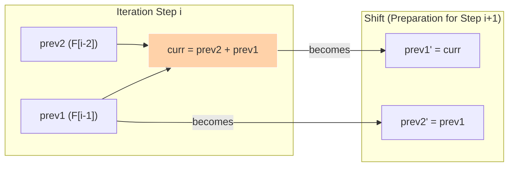

The Fibonacci sequence is a classic mathematical progression where each number is the sum of the two preceding ones. It serves as the perfect entry point to Dynamic Programming.

Mathematically, the sequence is defined as:
`F(n) = F(n-1) + F(n-2)`

with base cases:
`F(0) = 0, F(1) = 1`

---

## 1. DP Recipe Walkthrough

### State Definition
Let `dp[i]` represent the value of the i-th Fibonacci number `F(i)`.

### Base Cases
The first two values of the sequence are defined by default:
*   `dp[0] = 0`
*   `dp[1] = 1`

### State Transition Relation
For any index `i >= 2`, the state is computed as:
`dp[i] = dp[i-1] + dp[i-2]`

### Space Optimization
To compute the current value `dp[i]`, we only need the values of the last two states: `dp[i-1]` and `dp[i-2]`. Rather than allocating a full array of size `N + 1` (which consumes `O(N)` space), we can maintain just two variables representing the last two values.

As we progress, we "roll" these variables forward:



---

## 2. Python Implementations

### Approach 1: Standard 1D Tabulation — `O(N)` Space

This approach creates an array to store every Fibonacci number up to $N$.

```python
# Input
n = 10

# Initialize DP table
dp = [0] * (n + 1)
dp[0] = 0
dp[1] = 1

# Tabulate values sequentially
for i in range(2, n + 1):
    dp[i] = dp[i - 1] + dp[i - 2]

# Result is at index n
fib_n = dp[n]
print('Fibonacci number:', fib_n)
```

### Approach 2: Optimized Space Complexity — `O(1)` Space

This approach discards historical states and only retains the two values required for the current calculation.

```python
# Input
n = 10

# Base case handling
if n == 0:
    fib_n = 0
elif n == 1:
    fib_n = 1
else:
    # Initialize variables for F(0) and F(1)
    prev2 = 0
    prev1 = 1
    
    # Iterate and roll variables forward
    for i in range(2, n + 1):
        curr = prev1 + prev2
        prev2 = prev1
        prev1 = curr
        
    fib_n = prev1

print('Fibonacci number:', fib_n)
```
