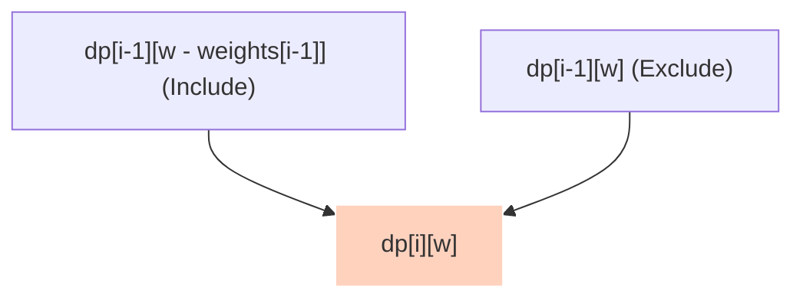
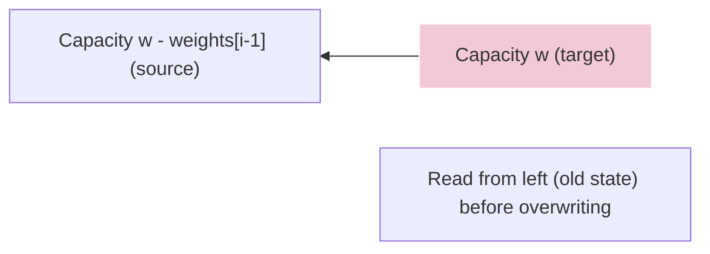

Given a set of `N` items, each with a weight and a value, determine the maximum value of items that can be fit into a knapsack of maximum weight capacity `W`. Each item can either be taken (1) or left behind (0).

---

## 1. DP Recipe Walkthrough

### State Definition
Let `dp[i][w]` represent the maximum value obtainable using a subset of the first `i` items (from index `0` to `i-1`) when the knapsack has a capacity of `w`.

### Base Cases
If either the number of items is `0` or the knapsack capacity is `0`, the maximum value is `0`:
*   `dp[0][w] = 0` (for all `0 <= w <= W`)
*   `dp[i][0] = 0` (for all `0 <= i <= N`)

### State Transition Relation
For each item `i` and capacity `w`:
1.  **Exclude the item**: The capacity remains `w`. The value is the same as the optimal value from the previous items: `dp[i-1][w]`.
2.  **Include the item** (only valid if `weights[i-1] <= w`): The capacity decreases by the item's weight. The value is the item's value plus the optimal value of the remaining capacity from the previous items: `values[i-1] + dp[i-1][w - weights[i-1]]`.

```text
If weights[i-1] <= w:
    dp[i][w] = max(dp[i-1][w], values[i-1] + dp[i-1][w - weights[i-1]])
Else:
    dp[i][w] = dp[i-1][w]
```



---

## 2. Space Optimization to 1D

Because the state transition for row `i` only requires data from row `i-1`, we can compress the 2D grid into a single 1D array `dp` of size `W + 1`. 

> [!WARNING]
> **Backward Iteration Required**: When updating the 1D table, the capacity `w` **must be traversed backwards** from `W` down to `weights[i-1]`.
> 
> If we iterate forwards, `dp[w - weights[i-1]]` would already contain the updated value from the *current* iteration, allowing an item to be selected multiple times. Iterating backwards ensures we only reference values from the *previous* row.



---

## 3. Python Implementations

### Approach 1: Standard 2D Tabulation — `O(N * W)` Space

```python
# Inputs
weights = [1, 2, 3]
values = [10, 15, 40]
capacity = 5

n = len(weights)

# Create a 2D DP table (size [n + 1] x [capacity + 1])
dp = [[0] * (capacity + 1) for _ in range(n + 1)]

# Tabulate maximum values
for i in range(1, n + 1):
    for w in range(1, capacity + 1):
        if weights[i - 1] <= w:
            dp[i][w] = max(values[i - 1] + dp[i - 1][w - weights[i - 1]], dp[i - 1][w])
        else:
            dp[i][w] = dp[i - 1][w]

# Max value is at the bottom-right cell
max_value = dp[n][capacity]
print('Maximum value:', max_value)
```

### Approach 2: Space Optimized 1D Tabulation — `O(W)` Space

```python
# Inputs
weights = [1, 2, 3]
values = [10, 15, 40]
capacity = 5

n = len(weights)

# Create a 1D DP table (size [capacity + 1])
dp = [0] * (capacity + 1)

# Tabulate values using backward iteration
for i in range(n):
    curr_weight = weights[i]
    curr_value = values[i]
    for w in range(capacity, curr_weight - 1, -1):
        dp[w] = max(dp[w], curr_value + dp[w - curr_weight])

# Result is the value at capacity
max_value = dp[capacity]
print('Maximum value:', max_value)
```
