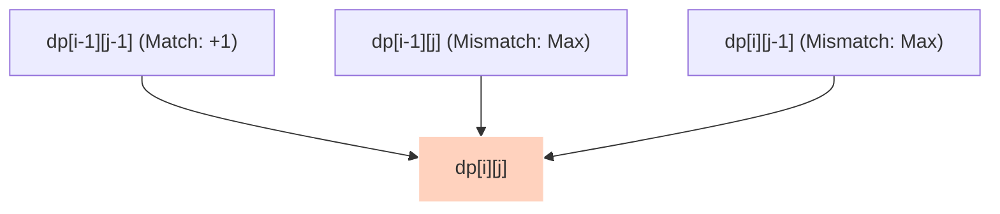

The Longest Common Subsequence (LCS) problem finds the length of the longest subsequence present in both strings in the same relative order, but not necessarily contiguously.

---

## 1. DP Recipe Walkthrough

### State Definition
Let `dp[i][j]` represent the length of the Longest Common Subsequence between the prefix `text1[0...i-1]` (length `i`) and `text2[0...j-1]` (length `j`).

### Base Cases
If either string is empty (length `0`), the length of the LCS is `0`:
*   `dp[0][j] = 0` (for all `0 <= j <= N`)
*   `dp[i][0] = 0` (for all `0 <= i <= M`)

### State Transition Relation
For characters at index `i-1` in `text1` and `j-1` in `text2`:
1.  **If they match** (`text1[i-1] == text2[j-1]`): The matching character is part of the LCS. We add `1` to the LCS of the remaining prefixes:
    `dp[i][j] = dp[i-1][j-1] + 1`
2.  **If they do not match**: We take the maximum LCS possible by either ignoring the current character of `text1` or ignoring the current character of `text2`:
    `dp[i][j] = max(dp[i-1][j], dp[i][j-1])`

```text
If text1[i-1] == text2[j-1]:
    dp[i][j] = dp[i-1][j-1] + 1
Else:
    dp[i][j] = max(dp[i-1][j], dp[i][j-1])
```



---

## 2. Space Optimization to Two Rows

Calculating `dp[i][j]` only requires values from the previous row `dp[i-1]` and the current row `dp[i]`. Thus, we do not need to store the entire `M * N` matrix. 

Instead, we can maintain two rows of size `N + 1`:
*   `prev`: represents the previous row `dp[i-1]`
*   `curr`: represents the current row `dp[i]`

After processing each row, we copy `curr` to `prev` and clear `curr`. This reduces space complexity from `O(M * N)` to `O(N)`.

---

## 3. Python Implementations

### Approach 1: Standard 2D Tabulation — `O(M * N)` Space

```python
# Inputs
text1 = 'abcde'
text2 = 'ace'

m = len(text1)
n = len(text2)

# Create a 2D DP table (size [m + 1] x [n + 1])
dp = [[0] * (n + 1) for _ in range(m + 1)]

# Fill the DP table
for i in range(1, m + 1):
    for j in range(1, n + 1):
        if text1[i - 1] == text2[j - 1]:
            dp[i][j] = dp[i - 1][j - 1] + 1
        else:
            dp[i][j] = max(dp[i - 1][j], dp[i][j - 1])

# Result is at the bottom-right cell
lcs_length = dp[m][n]
print('LCS Length:', lcs_length)
```

### Approach 2: Space Optimized 2-Row Tabulation — `O(N)` Space

```python
# Inputs
text1 = 'abcde'
text2 = 'ace'

m = len(text1)
n = len(text2)

# Create two rows (size [n + 1])
prev = [0] * (n + 1)
curr = [0] * (n + 1)

# Fill the DP table row by row
for i in range(1, m + 1):
    for j in range(1, n + 1):
        if text1[i - 1] == text2[j - 1]:
            curr[j] = prev[j - 1] + 1
        else:
            curr[j] = max(prev[j], curr[j - 1])
    # Roll the rows forward: copy curr to prev
    prev = list(curr)

# Result is at the end of the prev row
lcs_length = prev[n]
print('LCS Length:', lcs_length)
```
