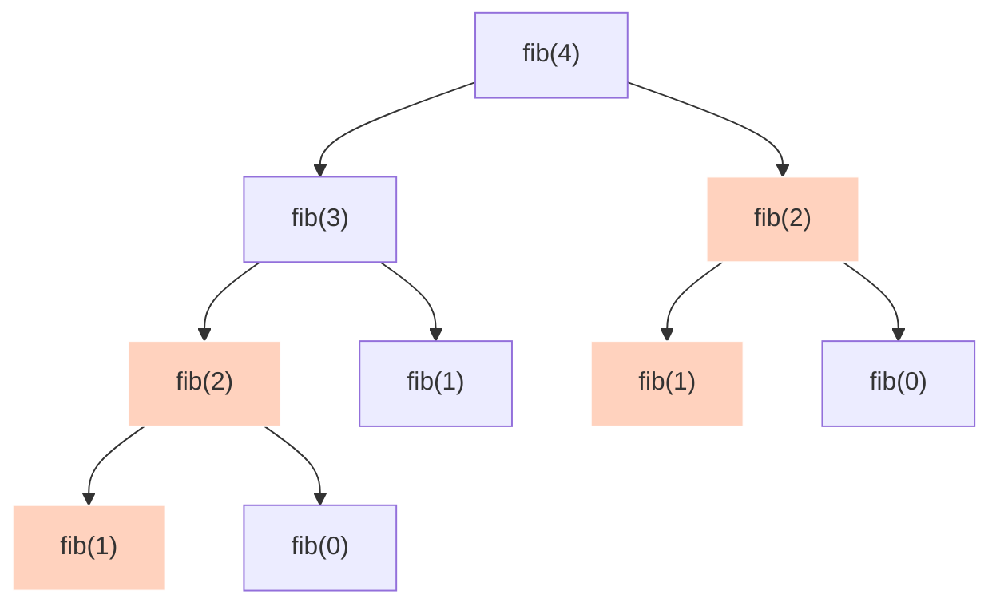
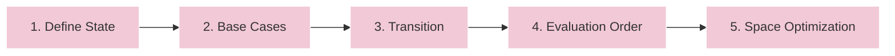

Dynamic Programming (DP) is an algorithmic paradigm that solves complex problems by breaking them down into simpler, overlapping subproblems, solving each subproblem exactly once, and storing their solutions to avoid redundant computations.

It is particularly powerful for optimization problems where you need to find the *maximum* or *minimum* value under certain constraints.

---

## 1. Core Properties

A problem can be solved using Dynamic Programming if it exhibits two key properties:

### Overlapping Subproblems
The problem can be broken down into smaller subproblems, and the solutions to these subproblems are reused multiple times. In contrast, divide-and-conquer algorithms (like QuickSort or MergeSort) split the problem into independent, non-overlapping subproblems.

Below is the recursion tree for calculating the 4th Fibonacci number, `F(4)`. The highlighted nodes represent duplicate work that DP seeks to eliminate:

### Optimal Substructure
An optimal solution to the global problem can be constructed efficiently from the optimal solutions of its subproblems. 

For example, in the Shortest Path problem, if the shortest path from node `u` to node `v` passes through node `w`, then the sub-path from `u` to `w` and the sub-path from `w` to `v` must also be the shortest paths between those respective nodes.

---

## 2. The 5-Step DP Recipe

To solve any Dynamic Programming problem systematically, follow this five-step engineering framework:

1. **State Definition**: Express the subproblem in terms of parameters. What does `dp[i]` or `dp[i][j]` represent in plain English? (e.g., `dp[i]` is the maximum profit we can make up to day `i`).
2. **Identify Base Cases**: Determine the simplest subproblems that can be solved immediately without dependencies (e.g., `F(0) = 0`, `F(1) = 1`).
3. **Establish State Transition Relation**: Formulate the mathematical recurrence relation that derives the current state from previously solved smaller states.
4. **Determine Evaluation Order**: Choose how to fill the DP table. Usually, we fill from smaller inputs to larger inputs (bottom-up), or resolve dependencies on-demand via recursion (top-down).
5. **Space Optimization (Optional)**: Analyze the transition relation. If the current state only depends on a few previous states (e.g., the last row or the last two cells), optimize the space complexity by discarding older states.

---

## 3. DP Approaches: Memoization vs. Tabulation

There are two primary paradigms for implementing a DP solution:

### Top-Down (Memoization)
This approach resolves the target problem recursively. When a subproblem is solved for the first time, its result is stored in a lookup table (memoized). Subsequent calls to the same subproblem immediately fetch the cached value.

*   **Execution**: Starts at the final objective and traverses down the recursion tree on-demand.
*   **Data Structure**: Typically uses a hash map or an array.

### Bottom-Up (Tabulation)
This approach solves all subproblems iteratively starting from the base cases. The results are stored in an array or matrix (table) which is filled cell-by-cell.

*   **Execution**: Starts from the base cases and systematically builds up to the final solution.
*   **Data Structure**: Typically uses a 1D, 2D, or multidimensional array.

---

## 4. Head-to-Head Comparison

| Feature | Top-Down (Memoization) | Bottom-Up (Tabulation) |
| :--- | :--- | :--- |
| **Strategy** | Recursive (Solve on-demand) | Iterative (Solve all sequentially) |
| **Call Stack** | Uses recursion (Risk of Stack Overflow) | No stack overhead (Iterative loop) |
| **State Traversal** | Only computes states needed for the target | Computes all subproblems in the state space |
| **Space Complexity** | `O(N)` stack space + `O(N)` table space | `O(N)` table space (often compressible to `O(1)`) |
| **Intuition** | Easy to conceptualize from a recursion tree | Requires thinking about evaluation order first |
