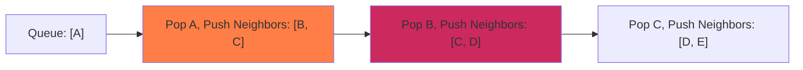

BFS explores nodes level-by-level, making it useful for finding the shortest path in unweighted graphs.

### Queue Traversal Flow

The queue and visited set states during BFS execution:



### Python Implementation

Here is the clean, bare Python script utilizing a queue (FIFO):

```python
# Graph represented as an adjacency list
graph = {
    'A': ['B', 'C'],
    'B': ['D'],
    'C': ['D', 'E'],
    'D': ['F'],
    'E': [],
    'F': []
}
start_node = 'A'

visited = []
queue = [start_node]
visited.append(start_node)

# BFS loop using FIFO queue
while queue:
    current = queue.pop(0)
    for neighbor in graph[current]:
        if neighbor not in visited:
            visited.append(neighbor)
            queue.append(neighbor)

print('BFS Traversal Path:', visited)
```
