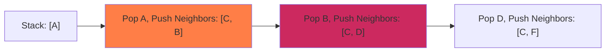

DFS explores as deep as possible along each branch before backtracking.

### Stack Traversal Flow

The stack and visited set states during DFS execution:



### Python Implementation

Here is the clean, bare Python script utilizing a stack (LIFO):

```python
# Graph represented as an adjacency list
graph = {
    'A': ['B', 'C'],
    'B': ['D'],
    'C': ['D', 'E'],
    'D': ['F'],
    'E': [],
    'F': []
}
start_node = 'A'

visited = []
stack = [start_node]

# DFS loop using LIFO stack
while stack:
    current = stack.pop()
    if current not in visited:
        visited.append(current)
        # Push neighbors in reverse to explore left-to-right
        for neighbor in reversed(graph[current]):
            if neighbor not in visited:
                stack.append(neighbor)

print('DFS Traversal Path:', visited)
```
