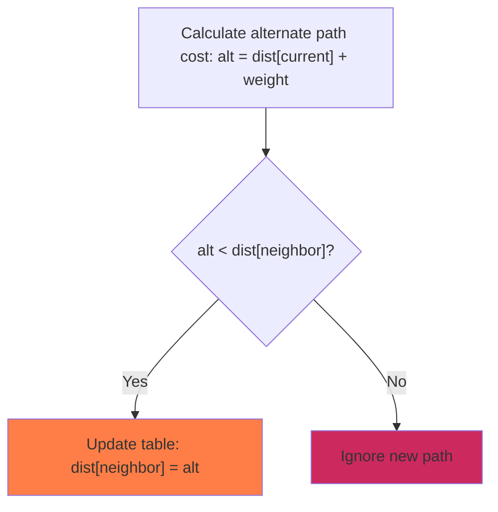

Dijkstra's algorithm finds the shortest path from a single source node to all other nodes in a weighted graph.

### Distance Relaxation Flow

The logic step for relaxation of node distances:



### Python Implementation

Here is the clean, bare Python script utilizing Dijkstra's algorithm:

```python
# Weighted Graph represented as adjacency list: (node: [(neighbor, weight)])
graph = {
    'A': [('B', 4), ('C', 2)],
    'B': [('D', 5)],
    'C': [('D', 1), ('E', 10)],
    'D': [('F', 3)],
    'E': [],
    'F': []
}
start_node = 'A'

# Initialize distance lookup table with infinity
distances = {node: float('inf') for node in graph}
distances[start_node] = 0
unvisited = set(graph.keys())

# Dijkstra optimization loop
while unvisited:
    # Pick unvisited node with the smallest recorded distance
    current_node = None
    min_dist = float('inf')
    for node in unvisited:
        if distances[node] < min_dist:
            min_dist = distances[node]
            current_node = node
            
    # Stop loop if no more reachable nodes are found
    if current_node is None or min_dist == float('inf'):
        break
        
    unvisited.remove(current_node)
    
    # Relax distances of all neighboring connections
    for neighbor, weight in graph[current_node]:
        distance = distances[current_node] + weight
        if distance < distances[neighbor]:
            distances[neighbor] = distance

print('Shortest distances from source node:', distances)
```
