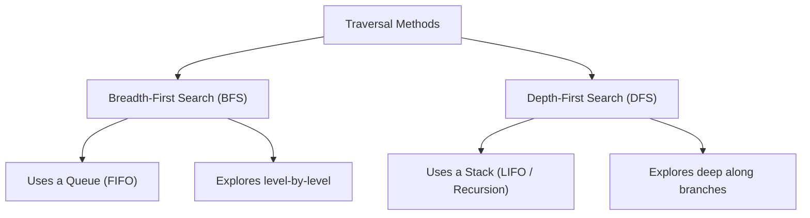
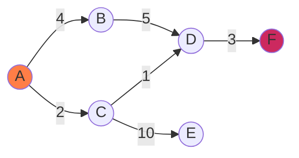

A graph is a non-linear data structure consisting of **vertices** (or nodes) connected by **edges**. Graphs are used to model networks, routing pathways, social connections, and hierarchical dependencies.

---

## 1. Graph Representations

There are two primary ways to store a graph in memory:

### Adjacency List
An array of lists, where the index represents a vertex, and the list contains the neighbors of that vertex.

*   **Space**: $O(V + E)$ — highly space-efficient for sparse graphs.
*   **Lookup**: $O(V)$ to check if an edge exists.

### Adjacency Matrix
A 2D grid of size $V \times V$ where `matrix[i][j]` is $1$ (or a weight value) if an edge exists between $i$ and $j$, and $0$ otherwise.

*   **Space**: $O(V^2)$ — memory-heavy.
*   **Lookup**: $O(1)$ to check if an edge exists.

---

## 2. Fundamental Traversals

Traversing a graph involves visiting every vertex exactly once.

---

## 3. Shortest Path (Dijkstra's)

Dijkstra's algorithm finds the shortest path from a single source node to all other nodes in a weighted graph with non-negative edge weights.

### Dijkstra Execution logic
1.  Initialize distances to all nodes as infinity ($\infty$), and distance to source node as $0$.
2.  Select the node with the minimum distance that hasn't been visited yet.
3.  Update the distance values of all adjacent neighbors of the selected node.
4.  Mark the selected node as visited. Repeat until all nodes are visited.
