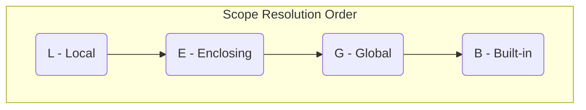
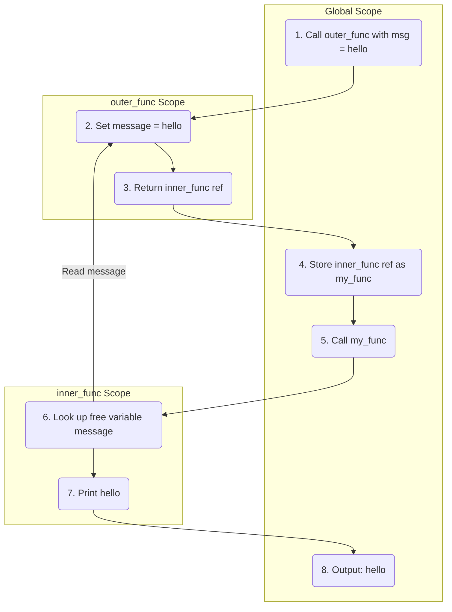
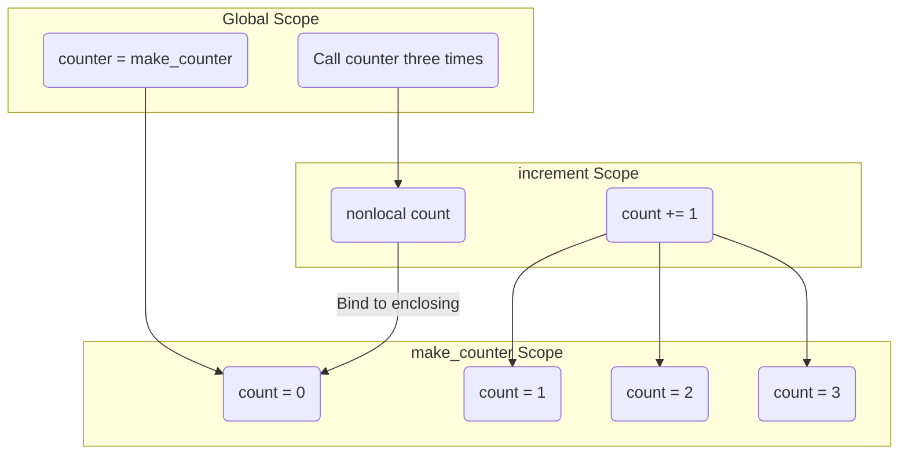

A **closure** is a function that remembers the variables from its enclosing scope, even after that scope has finished executing. This happens because the inner function captures a *reference* to the variable, not a copy of its value.

Three conditions must be met for a closure to exist:
*   There must be a **nested function** (a function defined inside another function).
*   The nested function must **reference a variable** from the enclosing function's scope (a *free variable*).
*   The enclosing function must **return** the nested function.

---

## LEGB Rule

To understand *how* closures find variables, you need to know Python's scope resolution order. When a name is referenced, Python searches four scopes in this order:

| Scope | Description |
|---|---|
| **L** — Local | Variables defined inside the current function |
| **E** — Enclosing | Variables in the nearest enclosing function (this is what closures use) |
| **G** — Global | Variables defined at the module level |
| **B** — Built-in | Names preloaded by Python (`print`, `len`, `range`, etc.) |

```python
built_in = print  # B - Built-in scope

x = 'global'  # G - Global scope

def outer():
    x = 'enclosing'  # E - Enclosing scope

    def inner():
        x = 'local'  # L - Local scope
        print(x)

    inner()

outer()  # Output: local
```

Python finds `x` in the **L**ocal scope first and stops. If you remove `x = 'local'` from `inner`, it falls through to **E**nclosing and prints `'enclosing'`.



Closures exist because of the **E** layer. When `inner_func` references a variable it didn't define, Python finds it in the enclosing scope and captures a reference to it.

---

## Basic Closure

```python
def outer_func(msg):
    message = msg

    def inner_func():
        print(message)

    return inner_func

my_func = outer_func('hello')
my_func()  # Output: hello
```

`message` is a **free variable** — it is not defined inside `inner_func`, but `inner_func` still accesses it after `outer_func` has returned.

### Execution Flow



---

## Closure as a Factory

Closures are commonly used to create **factory functions** — functions that generate customized functions on the fly.

```python
def make_multiplier(factor):
    def multiply(n):
        return n * factor
    return multiply

double = make_multiplier(2)
triple = make_multiplier(3)

print(double(10))  # Output: 20
print(triple(10))  # Output: 30
```

Each call to `make_multiplier` creates a **separate closure**, each capturing its own value of `factor`. `double` closes over `factor = 2`, `triple` closes over `factor = 3`. They do not interfere with each other.

---

## Mutating Closed Variables with `nonlocal`

By default, assigning to a variable inside the inner function creates a **new local variable** and shadows the outer one. To modify the outer variable in place, use `nonlocal`.

### Without `nonlocal` — this fails

```python
def make_counter():
    count = 0
    def increment():
        count += 1  # UnboundLocalError
        return count
    return increment
```

Python sees `count += 1` as an assignment and treats `count` as local to `increment`, but it hasn't been defined locally yet.

### With `nonlocal` — this works

```python
def make_counter():
    count = 0
    def increment():
        nonlocal count
        count += 1
        return count
    return increment

counter = make_counter()
print(counter())  # Output: 1
print(counter())  # Output: 2
print(counter())  # Output: 3
```

`nonlocal count` tells Python to look up `count` in the enclosing scope and modify it there.

### State Flow



---

## Late Binding Gotcha

Closures capture *references*, not *values*. This matters inside loops.

### The problem

```python
def make_funcs():
    funcs = []
    for i in range(3):
        def f():
            return i
        funcs.append(f)
    return funcs

for fn in make_funcs():
    print(fn())
# Output: 2, 2, 2
```

All three functions close over the **same variable** `i`. By the time they are called, the loop has finished and `i = 2`.

### The fix — capture with default argument

```python
def make_funcs():
    funcs = []
    for i in range(3):
        def f(captured=i):
            return captured
        funcs.append(f)
    return funcs

for fn in make_funcs():
    print(fn())
# Output: 0, 1, 2
```

Default arguments are evaluated at **function definition time**, so each `f` gets its own snapshot of `i`.

---

## Introspection

Python exposes closure internals through two special attributes on function objects.

```python
def outer(msg):
    message = msg
    def inner():
        print(message)
    return inner

my_func = outer('hello')
```

### `__code__.co_freevars`
Returns a tuple of the names of all free variables captured by the closure.

```python
print(my_func.__code__.co_freevars)
# Output: ('message',)
```

### `__closure__`
Returns a tuple of cell objects. Each cell wraps one captured variable.

```python
print(my_func.__closure__[0].cell_contents)
# Output: 'hello'
```

### Verifying a function is a closure

```python
print(my_func.__closure__ is not None)
# Output: True
```

A regular function (one that does not capture any free variables) will have `__closure__` set to `None`.

Closures become especially powerful when used as a design pattern — wrapping one function inside another to add behavior. This pattern is called a **decorator**.
