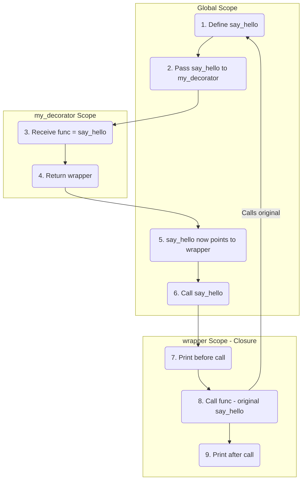
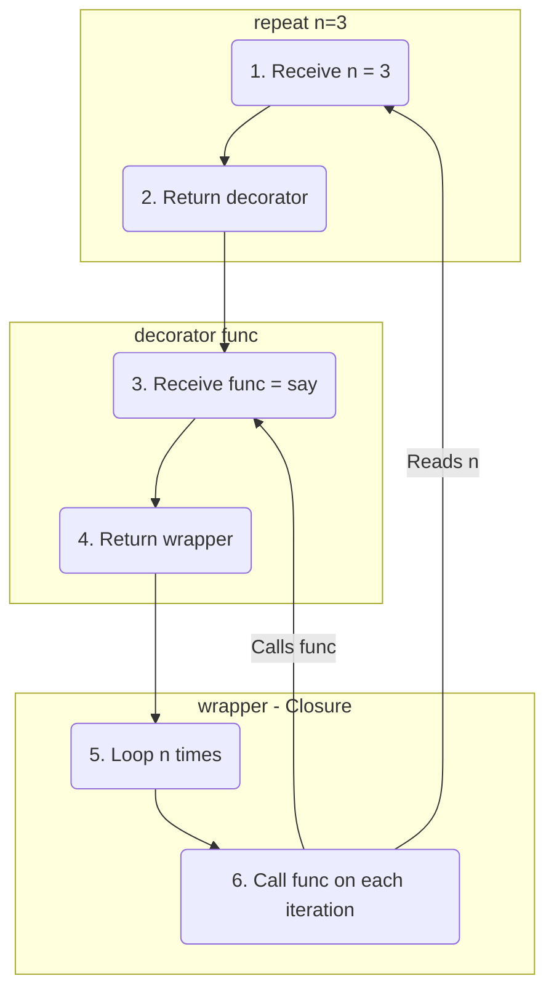
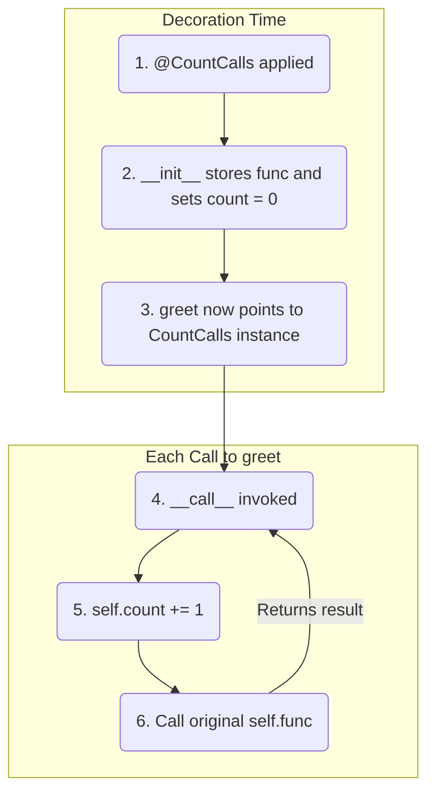

A **decorator** is a function that takes another function as input, wraps it with additional behavior, and returns the modified function. Under the hood, decorators are closures applied as a design pattern.

---

## Manual Wrapping (Without `@` Syntax)

Before learning the `@` shorthand, it helps to see what a decorator actually does:

```python
def my_decorator(func):
    def wrapper():
        print('before call')
        func()
        print('after call')
    return wrapper

def say_hello():
    print('hello!')

say_hello = my_decorator(say_hello)
say_hello()
# Output:
# before call
# hello!
# after call
```

`my_decorator` takes `say_hello`, wraps it inside `wrapper`, and returns `wrapper`. When we reassign `say_hello = my_decorator(say_hello)`, calling `say_hello()` now runs `wrapper()`.

> [!TIP]
> This is a closure — `wrapper` closes over the free variable `func` from the enclosing `my_decorator` scope.

### Execution Flow



---

## The `@` Syntax

The `@` symbol is syntactic sugar. It replaces the manual reassignment pattern.

```python
def my_decorator(func):
    def wrapper():
        print('before call')
        func()
        print('after call')
    return wrapper

@my_decorator
def say_hello():
    print('hello!')

say_hello()
# Output:
# before call
# hello!
# after call
```

`@my_decorator` above `def say_hello()` is exactly equivalent to writing `say_hello = my_decorator(say_hello)` after the function definition.

---

## Decorating Functions with Arguments

The basic `wrapper()` above takes no arguments. To decorate functions that accept arguments, use `*args` and `**kwargs`:

```python
def log_call(func):
    def wrapper(*args, **kwargs):
        print(f'calling {func.__name__} with args={args}, kwargs={kwargs}')
        result = func(*args, **kwargs)
        print(f'{func.__name__} returned {result}')
        return result
    return wrapper

@log_call
def add(a, b):
    return a + b

print(add(3, 5))
# Output:
# calling add with args=(3, 5), kwargs={}
# add returned 8
# 8
```

`*args` captures all positional arguments, `**kwargs` captures all keyword arguments. The wrapper forwards them to the original function untouched.

> [!NOTE]
> Wrapping a function replaces its `__name__` and `__doc__` metadata. Use `functools.wraps` to preserve them — see the **functools** article for details.

---

## Parameterized Decorators

Sometimes you need to pass arguments to the decorator itself. This requires an extra layer of nesting — a function that returns a decorator:

```python
def repeat(n):
    def decorator(func):
        def wrapper(*args, **kwargs):
            for _ in range(n):
                result = func(*args, **kwargs)
            return result
        return wrapper
    return decorator

@repeat(3)
def say(msg):
    print(msg)

say('hello')
# Output:
# hello
# hello
# hello
```

### How the Three Layers Work



*   `repeat(3)` executes first and returns `decorator`.
*   `decorator` receives `say` and returns `wrapper`.
*   `wrapper` closes over both `n = 3` and `func = say`.

---

## Stacking Decorators

Multiple decorators can be applied to a single function. They are evaluated **bottom-up** (closest to the function first), but execute **top-down**:

```python
def bold(func):
    def wrapper(*args, **kwargs):
        return f'<b>{func(*args, **kwargs)}</b>'
    return wrapper

def italic(func):
    def wrapper(*args, **kwargs):
        return f'<i>{func(*args, **kwargs)}</i>'
    return wrapper

@bold
@italic
def greet(name):
    return f'Hello, {name}!'

print(greet('Alice'))
# Output: <b><i>Hello, Alice!</i></b>
```

The stacking order `@bold @italic` is equivalent to:

```python
greet = bold(italic(greet))
```

*   `italic` wraps `greet` first → produces `<i>Hello, Alice!</i>`
*   `bold` wraps the result of `italic` → produces `<b><i>Hello, Alice!</i></b>`

---

## Practical Example — Timing Decorator

A real-world decorator that measures function execution time:

```python
import time

def timer(func):
    def wrapper(*args, **kwargs):
        start = time.perf_counter()
        result = func(*args, **kwargs)
        elapsed = time.perf_counter() - start
        print(f'{func.__name__} took {elapsed:.4f}s')
        return result
    return wrapper

@timer
def slow_function():
    time.sleep(1)
    return 'done'

print(slow_function())
# Output:
# slow_function took 1.0012s
# done
```

---

## Class-Based Decorators

Instead of using a nested function, you can use a class with `__init__` and `__call__`. This is useful when the decorator needs to maintain **state** across calls.

```python
class CountCalls:
    def __init__(self, func):
        self.func = func
        self.count = 0

    def __call__(self, *args, **kwargs):
        self.count += 1
        print(f'{self.func.__name__} has been called {self.count} times')
        return self.func(*args, **kwargs)

@CountCalls
def greet(name):
    return f'Hello, {name}!'

print(greet('Alice'))
print(greet('Bob'))
print(greet('Charlie'))
# Output:
# greet has been called 1 times
# Hello, Alice!
# greet has been called 2 times
# Hello, Bob!
# greet has been called 3 times
# Hello, Charlie!
```

### How It Works

*   `__init__` receives the decorated function and stores it. This runs once at decoration time.
*   `__call__` makes the class instance callable. Every time `greet()` is called, Python invokes `__call__` on the `CountCalls` instance.
*   `self.count` persists between calls because it lives on the instance, not inside a function scope.



> [!TIP]
> Use class-based decorators when you need persistent state. Use function-based decorators for simpler wrapping logic.

---

## Decorator Factories

A **decorator factory** is a function that creates and returns a decorator. The "Parameterized Decorators" section above is one example, but the pattern becomes more interesting when you want a decorator that works **both with and without arguments**:

```python
def log(func=None, *, prefix='LOG'):
    def decorator(func):
        def wrapper(*args, **kwargs):
            print(f'[{prefix}] calling {func.__name__}')
            return func(*args, **kwargs)
        return wrapper

    if func is not None:
        # Called without arguments: @log
        return decorator(func)
    # Called with arguments: @log(prefix='DEBUG')
    return decorator
```

This allows two usage styles:

```python
@log
def add(a, b):
    return a + b

@log(prefix='DEBUG')
def multiply(a, b):
    return a * b

print(add(2, 3))
# Output:
# [LOG] calling add
# 5

print(multiply(2, 3))
# Output:
# [DEBUG] calling multiply
# 6
```

### How the Dual Pattern Works

*   `@log` — `func` receives the function directly, so `decorator(func)` runs immediately.
*   `@log(prefix='DEBUG')` — `func` is `None` (keyword-only `*` forces it), so `decorator` is returned and Python applies it to `multiply` in a second step.

The `*` in the signature is critical — it forces `prefix` to be keyword-only, preventing Python from accidentally treating the decorated function as the `prefix` argument.

---

## Decorating Methods

When decorating **instance methods**, the wrapper must correctly handle `self` as the first argument. Since `*args` captures all positional arguments including `self`, this works transparently:

```python
def log_method(func):
    def wrapper(*args, **kwargs):
        print(f'calling {func.__name__}')
        return func(*args, **kwargs)
    return wrapper

class Calculator:
    def __init__(self, value):
        self.value = value

    @log_method
    def add(self, n):
        self.value += n
        return self.value

calc = Calculator(10)
print(calc.add(5))
# Output:
# calling add
# 15
```

`self` is passed as the first element of `*args`, so `func(*args, **kwargs)` correctly calls `func(self, n)`.

### The Gotcha — Class-Based Decorators on Methods

Class-based decorators do **not** work as instance method decorators out of the box:

```python
class LogCall:
    def __init__(self, func):
        self.func = func

    def __call__(self, *args, **kwargs):
        print(f'calling {self.func.__name__}')
        return self.func(*args, **kwargs)

class MyClass:
    @LogCall
    def greet(self, name):
        return f'Hello, {name}!'

obj = MyClass()
obj.greet('Alice')  # TypeError: greet() missing 'self' argument
```

The problem is that `obj.greet` returns the `LogCall` instance, not a bound method. Python's descriptor protocol (which injects `self`) only works with functions, not arbitrary callable objects.

The fix is to implement `__get__` to make the class-based decorator a descriptor:

```python
import types

class LogCall:
    def __init__(self, func):
        self.func = func

    def __call__(self, *args, **kwargs):
        print(f'calling {self.func.__name__}')
        return self.func(*args, **kwargs)

    def __get__(self, obj, objtype=None):
        if obj is None:
            return self
        return types.MethodType(self, obj)

class MyClass:
    @LogCall
    def greet(self, name):
        return f'Hello, {name}!'

obj = MyClass()
print(obj.greet('Alice'))
# Output:
# calling greet
# Hello, Alice!
```

`__get__` binds the `LogCall` instance to the object using `types.MethodType`, so `self` is injected correctly.

> [!NOTE]
> For most use cases, function-based decorators avoid this complexity entirely since plain functions already support the descriptor protocol.

---

## Built-in Decorators

Python provides several built-in decorators for class methods and properties. These are part of the language itself, not the `functools` module.

### `@staticmethod`

Defines a method that does not receive `self` or `cls`. It behaves like a regular function that happens to live inside a class.

```python
class MathUtils:
    @staticmethod
    def add(a, b):
        return a + b

print(MathUtils.add(3, 5))  # Output: 8
```

### `@classmethod`

Defines a method that receives the **class** (`cls`) as its first argument instead of the instance (`self`). Commonly used for alternative constructors.

```python
class Date:
    def __init__(self, year, month, day):
        self.year = year
        self.month = month
        self.day = day

    @classmethod
    def from_string(cls, date_str):
        year, month, day = map(int, date_str.split('-'))
        return cls(year, month, day)

    def __repr__(self):
        return f'{self.year}-{self.month:02d}-{self.day:02d}'

d = Date.from_string('2026-06-13')
print(d)  # Output: 2026-06-13
```

`cls` refers to the `Date` class itself. Calling `cls(year, month, day)` creates a new `Date` instance.

### `@property`

Turns a method into a read-only attribute. Allows controlled access to instance data without explicit getter/setter methods.

```python
class Circle:
    def __init__(self, radius):
        self._radius = radius

    @property
    def radius(self):
        return self._radius

    @radius.setter
    def radius(self, value):
        if value < 0:
            raise ValueError('radius cannot be negative')
        self._radius = value

    @property
    def area(self):
        return 3.14159 * self._radius ** 2

c = Circle(5)
print(c.radius)  # Output: 5
print(c.area)    # Output: 78.53975

c.radius = 10
print(c.area)    # Output: 314.159

c.radius = -1    # Raises ValueError: radius cannot be negative
```

*   `@property` defines the getter — access with `c.radius` (no parentheses).
*   `@radius.setter` defines the setter — assign with `c.radius = 10`.
*   `area` has no setter, so `c.area = 100` would raise `AttributeError`.
