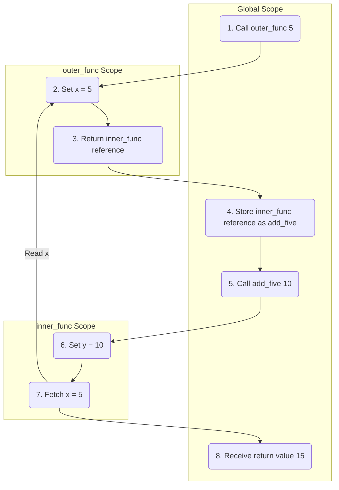

In Python, functions are **first-class citizens**. This means a function is treated like any other object — it can be:

*   **Assigned** to a variable
*   **Passed** as an argument to another function
*   **Stored** in a data structure
*   **Returned** from another function

---

## Assignment to Variables

Assigning a function reference to a variable without invoking it (no parentheses `()`).

```python
def greet(name):
    return f'Hello, {name}!'

# Assign reference, not the result
say_hello = greet

print(say_hello('Alice'))  # Output: Hello, Alice!
```

Both names point to the **same function object** in memory:

```python
print(greet is say_hello)  # Output: True
print(id(greet) == id(say_hello))  # Output: True
```

This works because `greet` without `()` evaluates to the function object itself, not its return value.

---

## Passing Functions as Arguments

Passing a function reference to another function to customize behavior.

> [!TIP]
> A function that **accepts** another function as an argument is called a **higher-order function**.

```python
def apply_operation(func, val):
    return func(val)

def double(n):
    return n * 2

print(apply_operation(double, 5))  # Output: 10
```

This is the same pattern Python's built-in `map` and `filter` use:

```python
numbers = [1, 2, 3, 4, 5]

squared = list(map(lambda x: x ** 2, numbers))
print(squared)  # Output: [1, 4, 9, 16, 25]

evens = list(filter(lambda x: x % 2 == 0, numbers))
print(evens)  # Output: [2, 4]
```

`map` receives a function and applies it to every element. `filter` receives a function and keeps only elements where it returns `True`. Neither would work if functions couldn't be passed as arguments.

---

## Storing in Collections

Storing function references inside lists, dictionaries, or tuples to execute them dynamically.

```python
def increment(x): return x + 1
def decrement(x): return x - 1

ops = {
    'inc': increment,
    'dec': decrement
}

print(ops['inc'](10))  # Output: 11
```

### Dispatch Table Pattern

This is commonly used to replace long `if/elif` chains with a clean lookup:

```python
def add(a, b): return a + b
def sub(a, b): return a - b
def mul(a, b): return a * b

dispatch = {
    '+': add,
    '-': sub,
    '*': mul
}

# Look up and call in one step
op = '+'
result = dispatch[op](10, 3)
print(result)  # Output: 13
```

Instead of branching through conditions, the dictionary maps a key directly to the function that handles it.

---

## Returning Functions from Functions

An outer function can define a nested inner function and return its reference without executing it.

> [!TIP]
> A function that **returns** another function is also a **higher-order function**.

```python
def outer_func(x):
    def inner_func(y):
        return x + y
    return inner_func

# Returns reference to inner_func
add_five = outer_func(5)

# Executes inner_func(10)
print(add_five(10))  # Output: 15
```

### Step-by-Step Execution
*   **Step 1**: `outer_func(5)` is invoked. It creates a local scope where `x = 5` and defines `inner_func`.
*   **Step 2**: `outer_func` returns the reference to `inner_func` without calling it, and its execution frame ends.
*   **Step 3**: The variable `add_five` stores the returned `inner_func` reference.
*   **Step 4**: When `add_five(10)` is invoked, it runs `inner_func(10)` where `y = 10`. It accesses `x = 5` from the parent environment and returns `15`.

### Reference Flow Visualization



Notice that `inner_func` still accesses `x` after `outer_func` has finished executing. This behavior — where a nested function remembers its enclosing scope — is called a **closure**.
