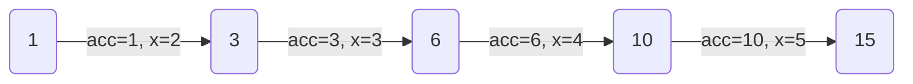

The `functools` module provides higher-order functions and utilities for working with callable objects. These are among the most commonly used tools in Python's standard library.

---

## `wraps`

Copies metadata (`__name__`, `__doc__`, `__module__`, `__qualname__`, `__annotations__`) from the original function to a wrapper. Essential when writing decorators.

```python
from functools import wraps

def my_decorator(func):
    @wraps(func)
    def wrapper(*args, **kwargs):
        return func(*args, **kwargs)
    return wrapper

@my_decorator
def greet(name):
    '''Return a greeting.'''
    return f'Hello, {name}!'

print(greet.__name__)  # Output: greet
print(greet.__doc__)   # Output: Return a greeting.
```

Without `@wraps(func)`, `greet.__name__` would return `'wrapper'` and `greet.__doc__` would return `None`.

---

## `lru_cache`

Memoization decorator that caches function return values. Uses a **Least Recently Used** eviction policy when the cache is full.

```python
from functools import lru_cache

@lru_cache(maxsize=128)
def fib(n):
    if n < 2:
        return n
    return fib(n - 1) + fib(n - 2)

print(fib(50))  # Output: 12586269025
```

Without `@lru_cache`, this recursive Fibonacci would make roughly $2^{50}$ calls. With it, each unique `n` is computed only once.

### Cache Info

```python
print(fib.cache_info())
# Output: CacheInfo(hits=48, misses=51, maxsize=128, currsize=51)
```

*   `hits` — number of times a cached result was returned
*   `misses` — number of times the function was actually called
*   `maxsize` — maximum cache capacity
*   `currsize` — current number of entries in the cache

### Clearing the Cache

```python
fib.cache_clear()
print(fib.cache_info())
# Output: CacheInfo(hits=0, misses=0, maxsize=128, currsize=0)
```

> [!TIP]
> Set `maxsize=None` for an unbounded cache. This is equivalent to using `@cache` (see below).

---

## `cache`

Simpler alias for `@lru_cache(maxsize=None)`. Added in Python 3.9. No eviction — the cache grows without limit.

```python
from functools import cache

@cache
def factorial(n):
    if n <= 1:
        return 1
    return n * factorial(n - 1)

print(factorial(10))  # Output: 3628800
print(factorial.cache_info())
# Output: CacheInfo(hits=0, misses=11, maxsize=None, currsize=11)
```

> [!WARNING]
> Since there is no eviction, `@cache` can consume significant memory for functions called with many distinct arguments. Use `@lru_cache(maxsize=N)` if memory is a concern.

---

## `partial`

Creates a new function with some arguments pre-filled. Useful for adapting functions to interfaces that expect fewer arguments.

```python
from functools import partial

def power(base, exponent):
    return base ** exponent

square = partial(power, exponent=2)
cube = partial(power, exponent=3)

print(square(5))  # Output: 25
print(cube(5))    # Output: 125
```

`square` is a new callable where `exponent` is permanently set to `2`. Only `base` needs to be provided.

### Inspecting a Partial

```python
print(square.func)      # Output: <function power at 0x...>
print(square.args)       # Output: ()
print(square.keywords)   # Output: {'exponent': 2}
```

### Practical Use — Callbacks

```python
from functools import partial

def log(level, message):
    print(f'[{level}] {message}')

warn = partial(log, 'WARN')
error = partial(log, 'ERROR')

warn('disk space low')    # Output: [WARN] disk space low
error('connection lost')  # Output: [ERROR] connection lost
```

---

## `reduce`

Applies a two-argument function cumulatively to the items of an iterable, reducing it to a single value.

```python
from functools import reduce

numbers = [1, 2, 3, 4, 5]

total = reduce(lambda acc, x: acc + x, numbers)
print(total)  # Output: 15
```

### Step-by-Step Reduction



*   **Step 1**: `acc = 1`, `x = 2` → `1 + 2 = 3`
*   **Step 2**: `acc = 3`, `x = 3` → `3 + 3 = 6`
*   **Step 3**: `acc = 6`, `x = 4` → `6 + 4 = 10`
*   **Step 4**: `acc = 10`, `x = 5` → `10 + 5 = 15`

### With an Initial Value

```python
total = reduce(lambda acc, x: acc + x, numbers, 100)
print(total)  # Output: 115
```

The third argument (`100`) is used as the initial accumulator value.

### Practical Use — Flattening Nested Lists

```python
from functools import reduce

nested = [[1, 2], [3, 4], [5, 6]]

flat = reduce(lambda acc, x: acc + x, nested)
print(flat)  # Output: [1, 2, 3, 4, 5, 6]
```

---

## `singledispatch`

Turns a function into a **single-dispatch generic function**. The implementation that runs is chosen based on the type of the first argument.

```python
from functools import singledispatch

@singledispatch
def process(data):
    raise TypeError(f'unsupported type: {type(data)}')

@process.register(int)
def _(data):
    print(f'processing integer: {data * 2}')

@process.register(str)
def _(data):
    print(f'processing string: {data.upper()}')

@process.register(list)
def _(data):
    print(f'processing list of {len(data)} items')

process(5)           # Output: processing integer: 10
process('hello')     # Output: processing string: HELLO
process([1, 2, 3])   # Output: processing list of 3 items
```

The base function decorated with `@singledispatch` acts as the default handler. Type-specific implementations are registered with `@process.register(type)`.

### Using Type Annotations (Python 3.7+)

```python
from functools import singledispatch

@singledispatch
def process(data):
    raise TypeError(f'unsupported type: {type(data)}')

@process.register
def _(data: float):
    print(f'processing float: {data:.2f}')

process(3.14159)  # Output: processing float: 3.14
```

When the type annotation is present in the function signature, `register` infers the type automatically.

---

## `total_ordering`

Class decorator that auto-generates missing comparison methods. You only need to define `__eq__` and one of `__lt__`, `__le__`, `__gt__`, or `__ge__` — the rest are filled in automatically.

```python
from functools import total_ordering

@total_ordering
class Student:
    def __init__(self, name, grade):
        self.name = name
        self.grade = grade

    def __eq__(self, other):
        return self.grade == other.grade

    def __lt__(self, other):
        return self.grade < other.grade

    def __repr__(self):
        return f'{self.name}({self.grade})'

a = Student('Alice', 90)
b = Student('Bob', 85)

print(a > b)   # Output: True  (auto-generated)
print(a >= b)  # Output: True  (auto-generated)
print(a <= b)  # Output: False (auto-generated)
print(a == b)  # Output: False (defined)
print(a < b)   # Output: False (defined)
```

Without `@total_ordering`, only `__eq__` and `__lt__` would work. The `>`, `>=`, and `<=` operators would raise `TypeError`.

> [!NOTE]
> `@total_ordering` generates the missing methods at class creation time. For performance-critical code with many comparisons, defining all six methods manually avoids the overhead of the generated wrapper logic.
